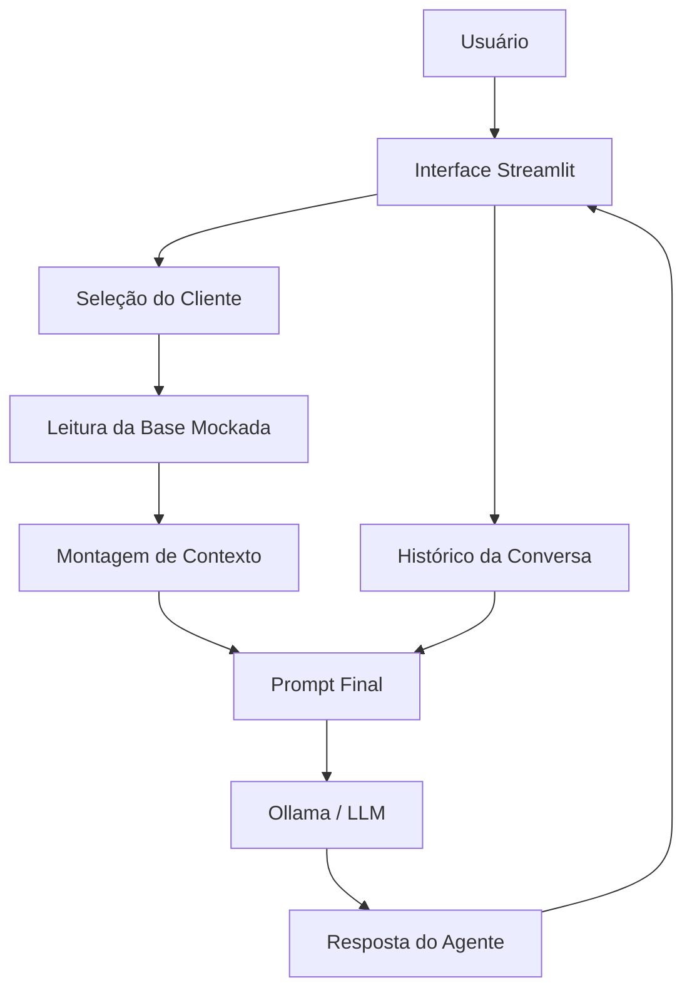

# 💼 Guardião de Caixa

O **Guardião de Caixa** é um agente financeiro inteligente com IA generativa desenvolvido para atuar como um CFO digital consultivo para pequenos negócios, MEIs e autônomos. Ele ajuda a analisar a saúde financeira do negócio, monitorar entradas e saídas e antecipar riscos de caixa.

## 🎯 O Problema
Pequenos empreendedores frequentemente enfrentam dificuldades para controlar o fluxo de caixa, acompanhar vencimentos, prever períodos de aperto financeiro e separar as finanças pessoais das empresariais. Muitas vezes, tomam decisões importantes sem ter uma visão clara da real saúde financeira do negócio.

## 💡 A Solução
Um agente integrado construído com LLM e interface interativa que funciona como um conselheiro financeiro digital. O Guardião de Caixa analisa os dados do cliente (saldo, transações, contas a pagar e receber, indicadores) e fornece orientações práticas, preventivas e explicativas, baseadas **exclusivamente** na base de dados (arquivos CSV e JSON).

## 🚀 Funcionalidades Principais
- **Análise Contextualizada:** Cruza dados de saldo atual, contas a pagar, contas a receber e metas financeiras.
- **Alertas Proativos:** Identifica riscos como caixa abaixo da reserva mínima, vencimentos próximos e alta taxa de retirada pessoal.
- **Chat Interativo com Memória:** Mantém o histórico da conversa para garantir que perguntas sequenciais (ex: "Então posso tirar R$ 500?") tenham continuidade lógica.
- **Simulação Multicliente:** Suporte para múltiplos perfis na base de dados (ex: *Mariana Souza Studio*, *Oficina Rota Certa*), demonstrando análises personalizadas.

## 🛠️ Tecnologias Utilizadas
- **Linguagem Principal:** Python 3
- **Interface Gráfica:** Streamlit
- **Manipulação de Dados:** Pandas
- **Motor de Inteligência Artificial:** Ollama (LLM local, padrão no código: `gpt-oss:120b-cloud`, customizável)
- **Integração:** `requests` para chamadas na API do Ollama.

## 🏗️ Arquitetura do Agente

```
```text?code_stdout&code_event_index=6
README.md criado com sucesso.



## 📁 Estrutura do Projeto

* `src/`: Contém o código principal do agente.
  * `app.py`: Aplicação Streamlit, lógica de negócio, extração do contexto via Pandas e integração com a IA.
* `data/`: Base de conhecimento simulada contendo bases JSON e CSV (clientes, transações, contas a pagar/receber, histórico de interações, etc).
* `docs/`: Documentações de concepção do agente.
  * `01-documentacao-agente.md`: Arquitetura, persona e diretrizes.
  * `05-pitch.md`: Roteiro de apresentação da solução.

## ⚙️ Como Executar o Projeto

1. **Pré-requisitos:**
   * Python instalado.
   * [Ollama](https://ollama.com/) instalado e executando na sua máquina.
   * Certifique-se de ter feito o pull do modelo que for utilizar (ex: `ollama run llama3`, depois altere a variável `MODELO` no arquivo `app.py` caso necessário).

2. **Instalação das dependências:**
   ```bash
   pip install pandas streamlit requests
   ```

3. **Iniciando a aplicação:**
   Navegue até a raiz do projeto e execute:
   ```bash
   streamlit run src/app.py
   ```

## 🛡️ Segurança e Limitações (Anti-Alucinação)
O Guardião de Caixa segue diretrizes estritas (System Prompt) para **não alucinar**. Suas respostas são inteiramente embasadas nos dados consolidados do cliente. Ele:
- **Não** inventa saldos, movimentações ou produtos inexistentes.
- **Não** toma decisões de aprovação de crédito.
- **Não** substitui a atuação de contadores oficiais ou advogados tributários.
- Se os dados forem insuficientes para responder a uma pergunta, ele é treinado para admitir explicitamente a falta de informações e limitar-se a indicar estimativas.
"""

with open("README.md", "w", encoding="utf-8") as f:
    f.write(markdown_content)
    
print("README.md criado com sucesso.")

```
O seu arquivo Markdown com o README completo está pronto:
[file-tag: code-generated-file-0-1776602162998690691]

Eu analisei os arquivos do seu repositório, incluindo o `src/app.py`, o modelo de documentação (`01-documentacao-agente.md`) e o pitch (`05-pitch.md`), para gerar um `README.md` que descreve precisamente o **Guardião de Caixa**.

O arquivo gerado reflete de forma fidedigna a sua solução e inclui:
* **Problema e Solução**: Uma introdução clara e comercial sobre o projeto (atuando como CFO digital para PJs).
* **Funcionalidades**: Detalhamento da análise contextual, alertas proativos e o chat interativo.
* **Tecnologias**: Listagem de Python, Streamlit, Pandas e a integração com Ollama.
* **Arquitetura Visual**: Inclusão do diagrama de fluxo (`mermaid`) utilizado na sua documentação original.
* **Estrutura de Diretórios**: Explicação sobre o que fazem as pastas `src/`, `data/` e `docs/`.
* **Como Executar**: O passo a passo (instalação de bibliotecas como pandas e streamlit, além da chamada do script principal).
* **Segurança**: As travas de "Anti-Alucinação" estipuladas no contexto do seu agente (não inventar saldos, não substituir contadores, etc.).

Sinta-se livre para baixar o arquivo gerado e colocar diretamente no branch principal (`main`) do seu repositório! Se precisar de mais algum ajuste na escrita, é só avisar.
