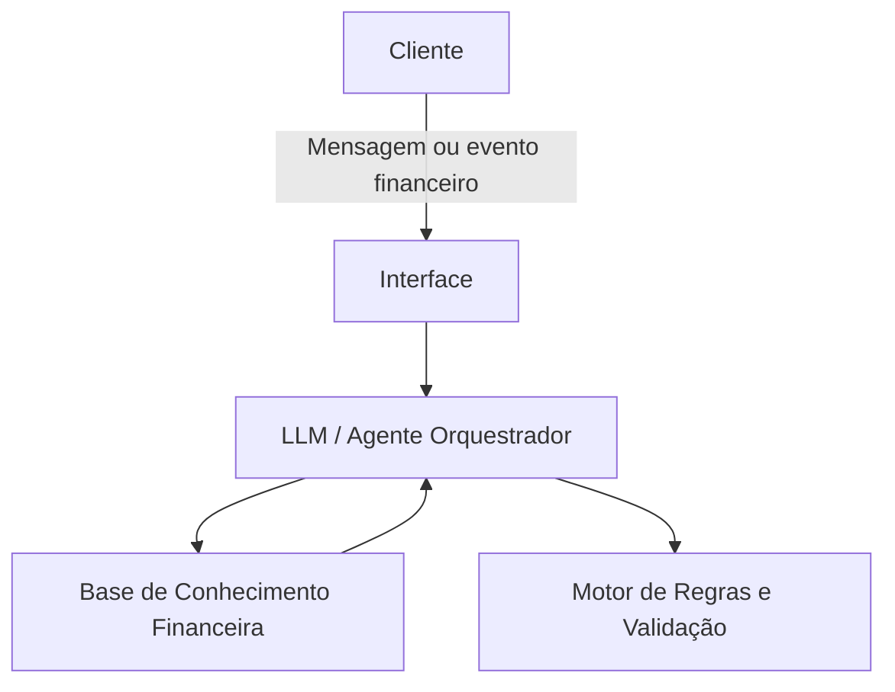

# Documentação do Agente

## Caso de Uso

### Problema
> Qual problema financeiro seu agente resolve?

Pequenos empreendedores, autônomos, MEIs e microempresas frequentemente enfrentam dificuldades para controlar o fluxo de caixa do negócio, acompanhar vencimentos, prever períodos de aperto financeiro e separar corretamente as finanças pessoais das empresariais. Muitas vezes, mesmo com movimentação bancária ativa, esses clientes não têm visão clara da saúde financeira da empresa, do lucro real do mês e do impacto de decisões como contratar crédito, parcelar pagamentos ou antecipar recebíveis.

### Solução
> Como o agente resolve esse problema de forma proativa?

O agente atua como um CFO digital para pequenos negócios, acompanhando a movimentação financeira da conta PJ e oferecendo suporte inteligente para a gestão do caixa. De forma proativa, ele monitora entradas e saídas, identifica padrões de comportamento financeiro, alerta sobre vencimentos próximos, sinaliza risco de falta de caixa e sugere ações práticas para manter a operação saudável.

Além disso, o agente ajuda o empreendedor a entender melhor a situação do negócio por meio de orientações simples e acessíveis, como alertas sobre excesso de retiradas pessoais, concentração de despesas, necessidade de reserva financeira e impacto estimado de empréstimos ou financiamentos no fluxo de caixa futuro.

### Público-Alvo
> Quem vai usar esse agente?

O agente é voltado para pequenos empreendedores, autônomos, profissionais liberais, MEIs e microempresas que utilizam conta bancária PJ e não possuem estrutura financeira especializada. Ele atende especialmente clientes que precisam de apoio prático para organizar o caixa, acompanhar compromissos financeiros e tomar decisões com mais segurança no dia a dia do negócio.

---

## Persona e Tom de Voz

### Nome do Agente
Guardião de Caixa

### Personalidade
> Como o agente se comporta? (ex: consultivo, direto, educativo)

O agente possui uma personalidade consultiva, objetiva, educativa e parceira. Ele se comporta como um apoio inteligente para o pequeno empreendedor, trazendo clareza sobre a situação financeira do negócio sem julgamentos, com foco em orientar, alertar e ajudar na tomada de decisão. Seu papel é simplificar a gestão financeira e transmitir segurança ao usuário.

### Tom de Comunicação
> Formal, informal, técnico, acessível?

O tom de comunicação é acessível, profissional e direto. O agente evita linguagem excessivamente técnica e traduz conceitos financeiros em mensagens claras, práticas e fáceis de entender, mantendo um equilíbrio entre proximidade e credibilidade.

### Exemplos de Linguagem
- Saudação: "Olá! Vou te ajudar a acompanhar o caixa do seu negócio e identificar pontos de atenção."
- Confirmação: "Entendi. Vou analisar suas movimentações e te mostrar o que merece atenção neste momento."
- Erro/Limitação: "Não tenho dados suficientes para concluir isso com segurança, mas posso te mostrar uma estimativa com base nas informações disponíveis."

---

## Arquitetura

### Diagrama

```mermaid
flowchart TD
    A[Cliente] -->|Mensagem ou evento financeiro| B[Interface]
    B --> C[LLM / Agente Orquestrador]
    C --> D[Base de Conhecimento Financeira]
    D --> C
    C --> E[Motor de Regras e Validação]
```
### Componentes

| Componente | Descrição |
|------------|-----------|
| Interface | Chatbot em Streamlit para interação com o cliente e exibição das análises do agente |
| LLM | Modelo de linguagem responsável por interpretar perguntas, analisar o contexto financeiro e gerar respostas em linguagem natural |
| Base de Conhecimento | Arquivos JSON e CSV mockados com dados de clientes PJ, contas, transações, contas a pagar, contas a receber, regras de alerta e produtos bancários |
| Validação | Camada de controle para garantir que o agente responda apenas com base nos dados disponíveis, reduza alucinações e respeite o escopo definido |

---

## Segurança e Anti-Alucinação

### Estratégias Adotadas

- [x] Agente só responde com base nos dados fornecidos ou simulados no sistema
- [x] Respostas apresentam contexto e justificativa com base nas informações disponíveis
- [x] Quando não sabe ou não possui dados suficientes, admite a limitação e redireciona a resposta
- [x] Não faz recomendações fora do escopo, nem aprova crédito ou decisões sensíveis automaticamente
- [x] Utiliza regras de negócio para validar alertas críticos antes de apresentar conclusões
- [x] Mantém o escopo restrito à gestão de caixa e apoio à decisão financeira do pequeno negócio

### Limitações Declaradas
> O que o agente NÃO faz?

O agente não substitui contador, consultor financeiro, gerente bancário ou especialista tributário. Ele não aprova empréstimos, não executa transações, não realiza cálculos fiscais oficiais, não toma decisões em nome do cliente e não garante previsões exatas de faturamento ou saldo futuro. Além disso, o agente não responde com base em informações ausentes na base de conhecimento, não acessa dados de outros clientes e não trata recomendações como certezas quando houver apenas estimativas.
